# Advanced_blockchain_application-

This application is used by customers to find fintech professionals from among a list of candidates, hire them, and pay them. This application is integrated with the Ethereum blockchain network in order to enable customers to instantly pay the fintech professionals, whom they hire with cryptocurrency. Throught this customers would able to send cryptocurrency payments to fintech professionals.

----------------------------------------------------------------------------------------------------------------------------------------------------------------------

Function 'Deposit' to deposit funds into smart contract. Function 'withdraw' to transfer funds between accounts. Function 'setAccounts' is to set and initialize accounts.

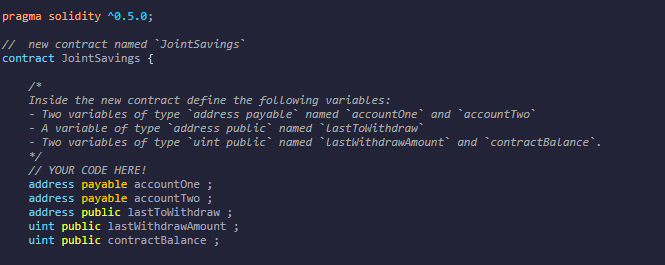

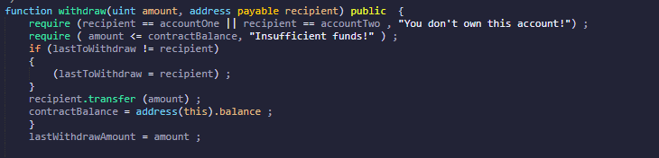

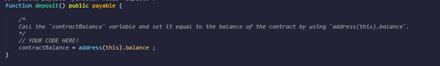

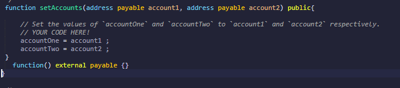

----------------------------------------------------------------------------------------------------------------------------------------------------------------------

Results after compiling

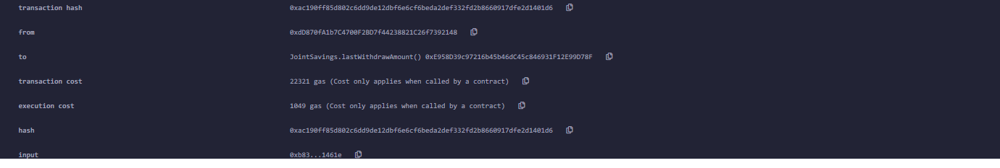

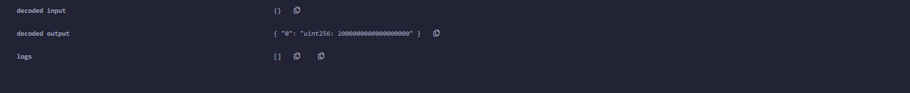

----------------------------------------------------------------------------------------------------------------------------------------------------------------------

Deposit funds snapshot

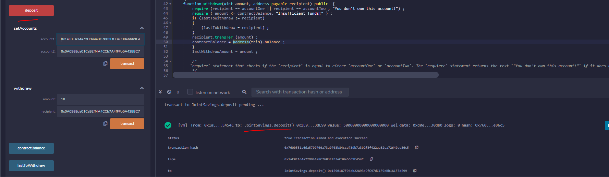

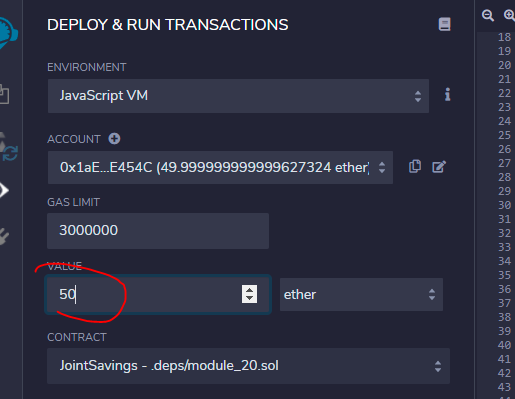

----------------------------------------------------------------------------------------------------------------------------------------------------------------------

Setup account snapshot

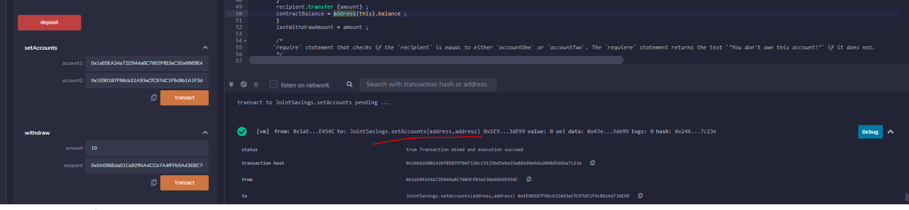

----------------------------------------------------------------------------------------------------------------------------------------------------------------------

Withdraw funds snapshot

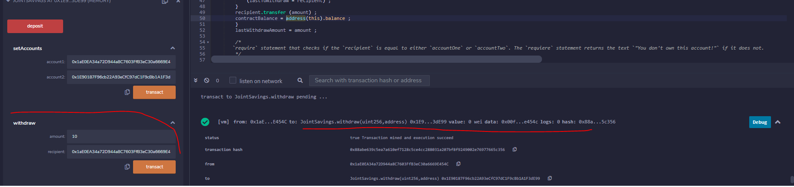

----------------------------------------------------------------------------------------------------------------------------------------------------------------------

Contract balance funds snapshot

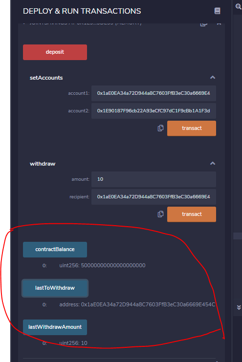

